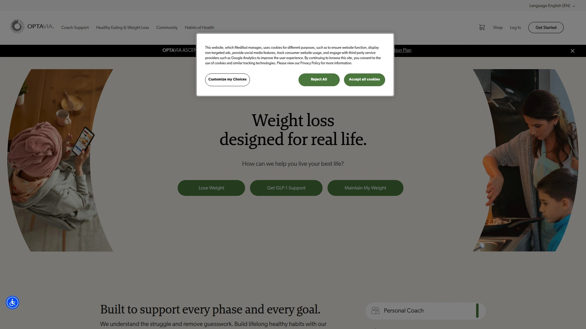

# Top 15 Best Weight Management Programs in 2025

So you're standing at the crossroads again. Another Monday morning, another promise to yourself that this time will be different. But here's the thing—it actually can be different. Not because of some magic pill or secret hack, but because the weight loss landscape has genuinely evolved. Programs now understand that you're not a calorie-counting robot; you're a human with cravings at 3 PM, weekend brunches with friends, and a life that doesn't fit neatly into meal prep containers.

The programs below represent something more useful than just diet plans. They're systems built around real behavioral science, backed by registered dietitians who actually get it, and designed to work with your messy, beautiful, complicated life. Whether you need structured meal delivery, flexible tracking, prescription medication support, or just someone who understands why you ate an entire sleeve of crackers last Tuesday, there's genuinely something here that might click for you.

---

## **[WeightWatchers](https://www.weightwatchers.com)**

The doctor-recommended heavyweight that figured out you don't need to give up pizza to lose weight—you just need to understand how pizza fits into your day.

This is the program that's been refining its approach for decades, and it shows. The Points system assigns values to foods based on nutritional content, with over 350 ZeroPoint foods you never have to measure or track. That means eggs, chicken breast, fish, most fruits and vegetables—the foundation foods—don't cost you anything from your daily budget. It's designed to guide you toward nutritious choices without making you feel like you're on restriction lockdown.

Members get access to unlimited virtual Workshops where real coaches and other members share what's actually working (and what spectacularly failed). The app now lets you use your camera to instantly track meals and calculate Points values, and it'll even analyze any recipe you find online to tell you what you're working with nutritionally. For those who qualify, there's also access to GLP-1 medications and support from menopause-trained clinicians.

Research shows members lose nearly four times more weight compared to DIY approaches, and Workshop attendees lose twice as much as those going solo. Plans start around $23 monthly for app-only access, with higher tiers including coaching and medication support options. It's particularly solid for people managing diabetes, with a tailored plan based on American Diabetes Association guidelines.

---

## **[Noom](https://www.noom.com)**

The psychology-forward app that treats weight loss like the behavior change problem it actually is, not just a math equation.

Noom categorizes foods into green, yellow, and orange zones based on caloric density, but nothing's forbidden. The real draw is the daily lessons rooted in cognitive behavioral therapy—short, digestible content that helps you understand why you eat when you're not hungry, how to handle stress without a pint of ice cream, and what's really going on when you self-sabotage three days into a new plan.

You'll get a personal coach who checks in regularly, plus access to support groups where people share wins and struggles in real time. The app includes comprehensive food logging with a database of over 3.7 million items, including restaurant meals, so your social life doesn't have to tank. Most users follow a 16-week plan with structured guidance, and the approach has shown effectiveness in multiple studies for both short and long-term weight loss.

The subscription runs about $70 monthly or $209 annually, positioning it as more affordable than meal-delivery services but pricier than basic tracking apps. It's especially useful for people who've tried everything else and suspect the issue might be more about their relationship with food than their knowledge of nutrition.

***

## **[MyFitnessPal](https://www.myfitnesspal.com)**

The sprawling food database champion that makes tracking almost effortless when you've got 11 million foods at your fingertips and a barcode scanner that actually works.

MyFitnessPal calculates your daily calorie target based on your stats and goals, then lets you log everything through an interface that's become second nature for millions of users. The database is genuinely massive—from obscure international snacks to your local restaurant's secret menu items, it's probably in there. You can also create custom recipes, save frequent meals, and the app remembers your favorites so logging breakfast doesn't take 10 minutes every morning.

The free version covers the essentials with calorie and basic macro tracking, water logging, and exercise integration. Premium ($9.99 monthly or $49.99 yearly) unlocks detailed macro targets, meal prep recipes, and guided fitness content. It syncs with virtually every fitness tracker and health app you can think of, making it a solid hub for your overall health data.

The main strength is flexibility—you can use this whether you're keto, vegan, counting macros, or just trying to be more mindful. The community forums offer recipes, tips, and success stories when you need motivation. Just know that all that freedom means you're responsible for your own accountability, which works beautifully for self-motivated people and less well for others.

***

## **[Calibrate](https://www.joincalibrate.com)**

The metabolic reset program that combines GLP-1 medications with lifestyle coaching to help you actually lower your biological set point instead of fighting it forever.

Calibrate's approach centers on the science that your body defends a certain weight through metabolic hormones, and that temporary dieting rarely changes this set point. They prescribe GLP-1 medications (the same class as Ozempic and Wegovy) to qualified members, which work by mimicking your body's natural satiety hormones to reduce hunger and help you feel full. This isn't a quick fix—it's positioning these medications like you'd use insulin for diabetes or statins for cholesterol, as long-term metabolic support.

Alongside medication, you work with a coach on four pillars: food, sleep, exercise, and emotional health. The program includes video classes explaining the biology behind each pillar and provides biweekly personalized goals. Research on their approach shows participants can lose 10% or more of body weight, with improvements in related conditions like high blood pressure, arthritis, and diabetes.

The program costs around $49-74 monthly (pricing varies), not including the medication itself, which depends on your insurance coverage. It's designed for people who've tried traditional approaches without lasting success and are ready for a medical intervention paired with sustainable habit change.

***

## **[Mayo Clinic Diet](https://www.mayoclinic.org/healthy-lifestyle/weight-loss/in-depth/mayo-clinic-diet/art-20045460)**

The medically-sound lifestyle program from one of the world's most respected health institutions that focuses on habit formation instead of calorie obsession.

The Mayo Clinic Diet unfolds in two phases: "Lose It!" where you jump-start weight loss over two weeks by adopting key habits, and "Live It!" where those habits become your long-term lifestyle. The focus is on adding good habits (like eating a healthy breakfast, exercising daily, eating more fruits and vegetables) while breaking less helpful ones (like eating while watching TV, snacking after dinner).

Rather than counting every calorie, you'll follow the Mayo Clinic Healthy Weight Pyramid, which emphasizes unlimited vegetables and fruits as the foundation, with reasonable portions of whole grains, lean proteins, and healthy fats. The program includes educational content explaining why certain changes matter and how they affect your metabolism and overall health.

It's notably cost-effective compared to meal delivery services or intensive coaching programs, with digital access starting around basic subscription pricing. This works exceptionally well for people who want evidence-based medical guidance without feeling micromanaged, and who can self-direct once they understand the principles. The diabetes-tailored option is particularly strong given Mayo Clinic's research depth.

***

## **[Nutrisystem](https://www.nutrisystem.com)**

The convenience-first meal delivery service that handles all the decision-making and portion control for you when willpower is exhausted and you just need the food to show up ready to eat.

Nutrisystem sends you shelf-stable and frozen meals covering breakfast, lunch, dinner, and snacks—basically your entire eating day arrives in boxes. You'll supplement with fresh produce, lean proteins, and healthy fats from your own grocery shopping, following their guide to round out nutrition. The meals themselves are portion-controlled and calorie-regulated, removing the guesswork around serving sizes.

Plans are gender-specific with different calorie targets, and there are specialized options for diabetics and vegetarians. The food selection includes comfort favorites like pizza, pasta, and burgers, all reformulated to fit the nutritional targets. Studies have shown it's effective for weight loss and particularly helpful for improving glycemic control in people with type 2 diabetes.

Pricing varies by plan but typically runs $300-400 monthly for the full meal package. This is genuinely convenient if meal planning feels overwhelming or you struggle with portion sizes, but it requires commitment to eating prepackaged food for most meals, which some people find monotonous over time. The transition off the program requires learning to replicate the structure independently.

***

## **[PlateJoy](https://www.platejoy.com)**

The personalized meal planning service that generates custom recipes based on your dietary preferences, then builds your shopping list automatically so you're not staring into the fridge wondering what dinner is.

PlateJoy creates weekly meal plans tailored to your specific needs—whether you're plant-based, keto, gluten-free, feeding a family, or managing food allergies. The system accounts for how many people you're cooking for, what kitchen equipment you own, and how much time you realistically have to cook. Each week you get recipes with step-by-step instructions and a categorized shopping list that can sync with grocery delivery services.

The nutrition breakdown is built into every recipe, and the app tracks your progress toward weight or health goals. You can swap out meals you're not feeling, exclude ingredients you hate, and save favorites for future rotations. The focus is on teaching you to cook balanced, portion-appropriate meals rather than relying on external products forever.

Subscriptions typically start around $12.99 monthly with various commitment lengths available. This is ideal for people who want structure and variety but prefer eating home-cooked meals over packaged options or who need specific dietary accommodations that standard plans don't address well.

***

## **[Lose It!](https://www.loseit.com)**

The calorie-tracking app with a slightly more goal-oriented interface than its competitors, featuring a free barcode scanner and genuinely useful visual progress tracking.

Lose It! calculates your personalized daily calorie budget based on your starting weight, goal weight, timeline, and activity level. You log foods through searching their database, scanning barcodes (free in the basic version, unlike some competitors), or snapping photos of your meals. The interface shows your daily calorie "bank account" with deposits from exercise and withdrawals from food, making the math immediately clear.

The app includes macro breakdowns, weight trend graphs, and community challenges that can make the process feel less isolating. Integration with fitness trackers means your workouts automatically adjust your daily budget. The free version is genuinely functional, though premium adds features like meal plans, macro planning, and more detailed analytics.

Research comparing nutrition apps found Lose It! had some accuracy limitations compared to professional standards, particularly for certain micronutrients. However, for straightforward calorie and macro tracking, it performs well and users often find the interface more intuitive and encouraging than some alternatives. It's particularly good for people who like gamification and visual feedback on their progress.

***

## **[Culina Health](https://culinahealth.com)**

The virtual registered dietitian network that provides one-on-one nutrition counseling covered by most insurance plans, with culturally competent care in 14 languages.

Culina Health connects you with an actual registered dietitian (not a health coach or nutritionist without credentials) for personalized video appointments. Sessions address everything from general healthy eating to medical nutrition therapy for diabetes, PCOS, eating disorders, pregnancy nutrition, and autoimmune conditions. Your dietitian creates a customized plan considering your lifestyle, culture, environment, schedule, and food preferences—not just handing you a generic printout.

The Culina Health Method has demonstrated sustained weight loss and effective disease management with outcomes exceeding industry standards for nutrition care. Their emphasis on empathetic, collaborative coaching means you're building confidence in making food choices rather than just following rules you don't understand. Most patients receive full insurance coverage, with affordable self-pay options available for those without coverage.

This is particularly valuable if you have specific medical conditions requiring nutrition intervention, if previous diet attempts have left you confused or burned out, or if you need someone who understands your cultural food traditions. The telehealth model removes geographic barriers and scheduling constraints that make traditional dietitian access challenging.

---

## **[Stronger U Nutrition](https://strongeru.com)**

The macro-focused coaching program where registered dietitians teach you to hit personalized macronutrient targets instead of just counting calories, with genuine one-on-one support that adjusts as you progress.

Stronger U assigns you a dedicated nutrition coach (many are RDs) who calculates your specific macro targets for protein, carbs, and fats based on your goals, activity level, and body composition. You'll log your food in an app they recommend (usually MyFitnessPal), and your coach reviews your data weekly, making adjustments if you're not seeing expected progress. The coaching relationship is the centerpiece—you can message your coach anytime with questions, struggles, or wins.

The approach teaches you to eat all types of foods while hitting macro targets, which gives you flexibility to eat out, enjoy treats, and maintain your social life without derailing. Many users report that the macro focus helps them feel fuller throughout the day, especially with the emphasis on adequate protein intake. The program includes educational content about why macros matter and how to make sustainable changes beyond just following a plan.

Pricing is around $159 monthly with a 30-day money-back guarantee. Discounts are sometimes available for longer commitments. This works exceptionally well for people interested in fitness who want to understand their nutrition at a deeper level, or those who've realized that simple calorie counting isn't giving them the results they want.

***

## **[Precision Nutrition](https://www.precisionnutrition.com)**

The habit-based coaching platform that breaks down overwhelming change into tiny daily practices while providing support from certified nutrition coaches who specialize in sustainable transformation.

Precision Nutrition's approach centers on building one small habit at a time rather than overhauling everything simultaneously. You might spend two weeks just practicing eating slowly and mindfully before moving to the next habit. The program provides daily lessons, practices, and check-ins through their app, with regular communication from your assigned coach.

The ProCoach platform includes custom nutrition and fitness programming, habit-tracking tools, and a massive recipe database. Coaches use motivational interviewing and behavior change psychology rather than just prescribing meal plans. The program is designed to work for any dietary preference or restriction—the principles about portion awareness, meal timing, food quality, and eating psychology apply universally.

This is a longer-term program (typically 12 months) focused on complete lifestyle change rather than quick weight loss. Pricing varies based on coaching level, with self-guided options running less than full one-on-one coaching. It's ideal for people who've yo-yo dieted before and recognize they need to fundamentally change their relationship with food and habits, not just follow another restrictive plan.

***

## **[FatSecret](https://www.fatsecret.com)**

The no-nonsense free calorie tracker with zero ads or premium upsells, offering a comprehensive food database and surprisingly robust features for people who just want straightforward tracking.

FatSecret provides calorie and macro tracking with a large international food database, barcode scanning, and the ability to save custom meals and recipes. Unlike many "free" apps that gate useful features behind paywalls, FatSecret's core functionality is genuinely free without constant upgrade prompts or advertisements cluttering your experience. You can track micronutrients, set goals, log exercise, and monitor your weight trends.

The interface is clean and functional without being flashy—this is a tool for people who want to track their intake efficiently and move on with their day. The community features include forums for support, recipes, and advice from other users worldwide. Integration with various fitness trackers and health apps means your data can flow between platforms.

This is particularly appealing if you're turned off by subscription fatigue or don't need coaching and meal plans—just a reliable way to log food and see your nutritional breakdown. The lack of AI-generated meal suggestions or behavior change lessons means you're self-directing, which works great for disciplined trackers but offers less hand-holding than alternatives.

***

## **[Fitbit Premium](https://www.fitbit.com/global/us/products/services/premium)**

The activity-focused subscription that integrates nutrition tracking with your existing Fitbit ecosystem, giving you a unified view of calories in versus calories out plus guided fitness content.

If you already own a Fitbit device, Premium extends the nutrition features beyond basic food logging to include detailed macronutrient breakdowns, personalized daily goals, and insights connecting your eating patterns to your activity and sleep data. You can track food through the database, scan barcodes, and see how your nutritional intake affects your energy levels and workout performance.

Premium adds guided programs, mindfulness content, advanced sleep tools, and personalized health insights based on all your tracked data. The food tracking can optionally hide calorie numbers if you're focusing on nutrition quality rather than restriction. The system tracks your macros as percentages and grams, showing weekly trends.

Pricing runs around $9.99 monthly or discounted with annual commitment. This makes sense primarily if you're already using Fitbit devices and want a more integrated experience rather than juggling multiple apps. The food database and tracking experience are solid but not superior to dedicated nutrition apps, so the value is really in the ecosystem integration and additional wellness content.

***

## **[Optavia](https://www.optavia.com)**

The structured meal replacement program built around eating six small "Fuelings" throughout the day, designed for people who want maximum structure and don't mind eating mostly prepackaged items.

Optavia's model has you eating five pre-portioned Fuelings (shakes, bars, soups, and snacks) plus one Lean & Green meal you prepare with lean protein and non-starchy vegetables. The Fuelings are calorie-controlled and nutritionally formulated to keep you in a specific daily calorie range, typically quite low. You'll also get a personal coach who's gone through the program themselves.

The plans include options for different calorie needs and goals, with some flexibility to swap which Fuelings you receive each month. Everything arrives at your door on a monthly schedule. The approach is designed to trigger relatively rapid initial weight loss through controlled calorie restriction and frequent eating to manage hunger.

Monthly costs run $395-442 depending on which plan you choose, plus you'll need to buy fresh ingredients for your daily Lean & Green meal. This is genuinely convenient for people who struggle with meal planning or portion control, but the low calorie level and reliance on packaged foods makes long-term adherence challenging for many. Critics note that the extreme structure doesn't teach you to navigate regular eating situations, making weight regain common after discontinuing.

***

## **[Jenny Craig](https://www.jennycraig.com)**

The classic portion-controlled meal delivery program with personal coaching that's been helping people lose weight for decades through simplicity and structure, now operating as a digital-first service.

Jenny Craig provides pre-portioned meals and snacks covering most of your eating, supplemented with fresh foods you add following their guide. You receive personalized coaching, nutrition guidance, and a structured menu that includes familiar comfort foods in appropriate serving sizes. Meals arrive at your home monthly and are designed to take the decision-making completely out of your hands while you learn what proper portions actually look like.

The program often incorporates intermittent fasting principles with a 10-hour eating window. You'll eat breakfast, lunch, dinner, and often a dessert within that window, with an energy bar allowed outside if needed. The food selection includes everything from pizza to chocolate brownies, all reformulated to fit the nutritional targets.

Research has shown Jenny Craig to be among the most effective commercial weight loss programs for both short and long-term results. Pricing typically starts around $137 weekly or about $550 monthly. The program recently relaunched as digital-only after bankruptcy, so current offerings may differ from the traditional in-person model. This works well for people who value maximum convenience and clear structure but requires transitioning to independent eating eventually.

***

## Why does weight management actually stick sometimes but not others?

The honest answer is that successful weight management aligns with how you actually live instead of demanding you become a different person. Programs that teach skills and build habits (like recognizing hunger cues, managing stress without food, or meal planning efficiently) create lasting change compared to those that just tell you what to eat. The ones with accountability—whether through coaching, community, or tracking—dramatically improve outcomes because consistency matters more than perfection. And increasingly, we're recognizing that for some people, biological factors like metabolic set point mean medication support isn't cheating, it's addressing the actual physiological challenge.

***

## What should you actually look for when choosing a program?

Think about your specific barriers first. If meal planning overwhelms you, a delivery service or detailed meal plan app might be crucial. If you've lost weight before but can't keep it off, programs focused on behavior change and habit formation address that specific problem. Consider your learning style—do you want education and autonomy, or clear rules and structure ? Budget matters too; effective options exist across the price spectrum from free tracking apps to comprehensive medical programs. And honestly evaluate how much support you need—some people thrive with just an app, others need regular human contact to stay accountable.

***

## Are those prescription weight loss medications everyone's talking about actually worth considering?

For people with a BMI over 30 (or 27 with weight-related health conditions) who haven't succeeded with lifestyle changes alone, GLP-1 medications show significant effectiveness in research. They work by reducing hunger and increasing satiety through the same biological pathways your body uses naturally. The key is viewing them as long-term tools for managing a chronic condition rather than quick fixes—you'll likely need to stay on them and maintain lifestyle changes to preserve results. Programs like **[WeightWatchers](https://www.weightwatchers.com)** Clinic and **Calibrate** now integrate these medications with coaching and behavior change support, which research suggests is more effective than medication alone. They're not magic and they're not necessary for everyone, but they're legitimate medical tools that can make a meaningful difference when other approaches haven't worked.
